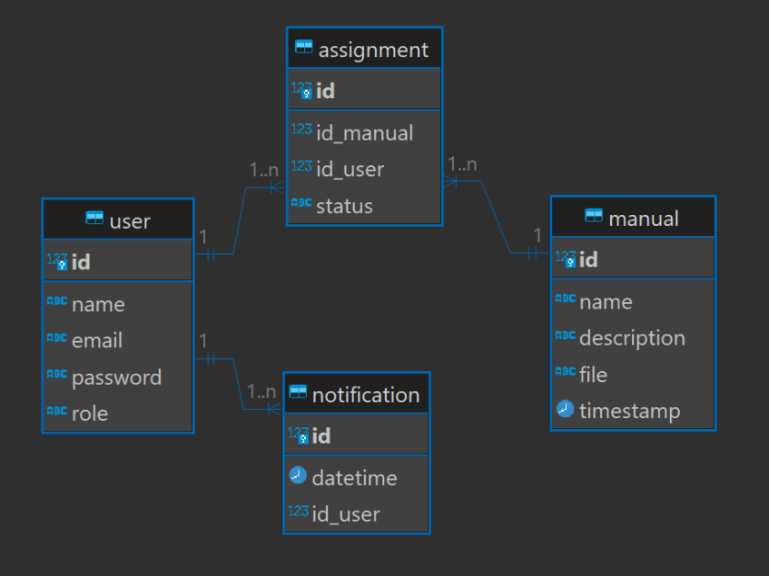

# Ponderada-DB
 

O atual trabalho representa uma modelagem de banco de dados para uma atividade ponderada de programação para o Inteli.

A modelagem do banco de dados foi realizada no site [SQLDesign](https://sql.toad.cz) e posteriormente exportada em ``xml`` e ``sql``. Desse modo, o arquivo ``database.xml`` apresenta o tipo de atributo ``ENUM`` que serviria para armazenar os valores: engenheiro ou montador, mas virou ``VARCHAR`` ou ``TEXT`` ao ser formatado para PostgreSQL.

Com essas observações feitas, o banco de dados atual foi modelado utilizando quatro entidades: três principais (_user_, _manual_ e _notification_) e uma intermediária (_assignment_). Uma explicação de cada uma delas pode ser visto a seguir:

1. **Tabela `user`:** Esta tabela armazena informações sobre os usuários do sistema. Cada usuário tem um ID único, nome, email, senha e cargo, que pode ser "engenheiro" ou "montador".

2. **Tabela `manual`:** Essa tabela mantém os detalhes dos manuais de construção dos produtos. Cada manual tem um ID único, nome, descrição, arquivo (que pode ser um caminho para o arquivo no sistema de arquivos ou uma referência ao arquivo armazenado no banco de dados), data de atualização e o ID do usuário responsável pela atualização do manual.

3. **Tabela `notification`:** Esta tabela registra as notificações enviadas aos usuários sobre as atualizações nos manuais. Cada notificação tem um ID único, data de envio e o ID do usuário destinatário da notificação.

4. **Tabela `assignment`:** Essa tabela relaciona os manuais aos usuários, especificando quais manuais foram atribuídos a quais usuários e o status da atribuição (concluído ou pendente). Cada atribuição tem um ID único, ID do manual, ID do usuário e status.

Definidas as entidades, algumas relações foram definidas entre elas. No modelo proposto, as relações de cardinalidade são:

- **Entre `user` e `manual`**: A relação é de muitos para muitos (N:N), intermediada pelas tabela `assignment`. Isso significa que um usuário pode ser atribuído a zero ou mais manuais, e um manual pode ser atribuído a zero ou mais usuários.

- **Entre `user` e `notification`**: Cada notificação é destinada a um único usuário, mas um usuário pode ter zero ou muitas notificações (1:N).

Uma observação final é que a tabela `assignment` poderia chamar-se `user_manual` também por representar uma tabela intermediária.

Obs: Esse repositório do Github sobre DBeaver parece ter boas informações se ainda não acessou: [Link](https://github.com/dbeaver/dbeaver/wiki/ER-Diagrams).
